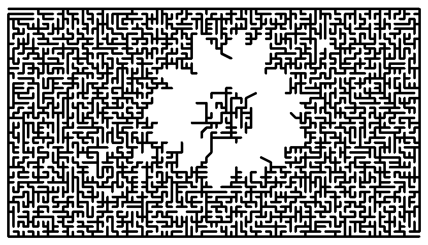

# maze

maze.py is a program that creates a maze that looks like any picture.
WARNING: this program is very slow!
Making a maze that from an n x m image, will take O(n2 m2) time!

Here are some example inputs and outputs:

| Input | Output |
| :---: | :---: |
|  |  |
| {width=200px} |  |
|  |  |
|  |  |

Here are some examples of typical usage:

	python maze.py lenna.png -resolution [64,64] -out lenna_maze
	python maze.py -v pictures/lenna.png -channel blue -wallcolor blue

Boolean Options:

	-v            verbose: prints runtimes for each part of the program.

	-invert       inverts the brightness values of the image, so dark
	              parts become light and vice versa.

	-l1           makes the program use the l1 distance instead of the
	              euclidean (l2) distance when generating the minimum
	              spanning tree. This means that the maze will look
	              more grid-like (I think... I'm not sure though).

String Options:

	-in           denotes the input filename. By default this argument
	              is not necessary, and the first string in the list of
	              arguments that is not part of any other argument will
	              be used as the input filename.

	-out          denotes the output filename. As with -in, by default
	              this argument is not necessary, and the second free
	              string in the list of arguments will be taken as the
	              output filename.
	              NOTE that the argument to -out should not include an
	              extension (like .png), since if output is requested,
	              it will be generated to two different files, an .eps
	              file and a .png file, with the same name before the
	              extension.
	              ALSO NOTE that if no output filename is specified,
	              the program will not produce an output file, and
	              will instead only display the maze on screen.

	-channel      denotes the source channel for the brightness values
	              used by the program.
	              Options are: brightness, red, blue, or green.
	              Default value is '-channel brightness'.

	-wallcolor    is the color for drawing the walls of the maze.
	              Default value is '-wallcolor black'.

	-bgcolor      is the color for drawing the background of the maze.
	              Default value is '-bgcolor white'.

Integer Options:

	-wallwidth    is the width of the maze walls when drawn.
	              Default value is '-wallwidth 5'.

	-hallwaywidth is the width of the maze hallways when drawn.
	              Default value is '-hallwaywidth 8'.

	-borderwidth  is the width of the maze border when drawn.
	              Default value is '-borderwidth 20'.

Other Options:

	-resolution   is the resolution of the maze, meaning that if the
	              maze is completely full of maze (i.e. if the image
	              was completely black), and if the resolution is [n,m]
	              then the maze will have n-1 vertical columns and m-1
	              horizontal rows.
	              WARNING: this is the part that scales poorly, i.e.
	              if -resolution [n,m] is passed, then the program will
	              run in O(n^2 m^2) time. And if the -resolution
	              argument is not included, then the resolution of the
	              maze will default to the resolution of the input image
	              which could be very large!

	-randomness   is an argument that makes the maze look a little more
	              random and natural. If -randomness 0 is passed, then
	              the output maze will look very homogeneous along the
	              edges.
	              WARNING: if the randomness is set too high, then it is
	              possible for an unsolvable maze to be generated!
	              Default value is -randomness 0.1, which in practice
	              has not created any unsolvable mazes yet.

	-help         prints the help dialog.

